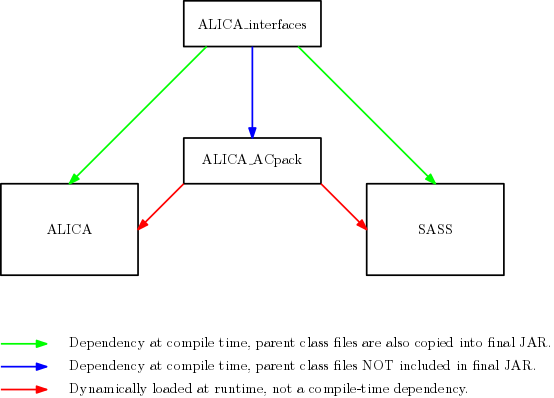

# ALICA AC Pack

- 

This package contains analyzer and controller implementations for
[ALICA](https://github.com/LEB-EPFL/ALICA), the automatic illumination
control package for light microscopy. It is a run-time dependency
of ALICA.

## Documentation

http://alica-ac-pack.readthedocs.io/en/latest/

## Relationship with ALICA and SASS

These implementations are maintained separately of ALICA because they
are used in [SASS](https://github.com/LEB-EPFL/SASS) as well.
